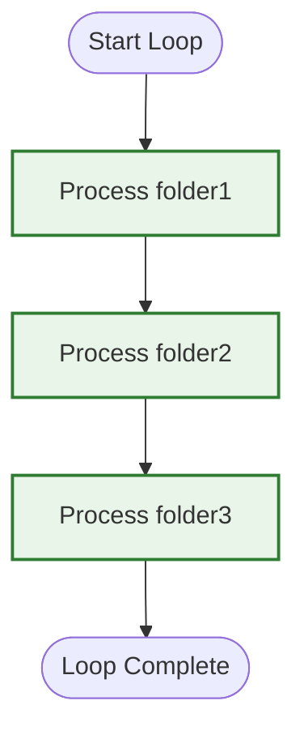
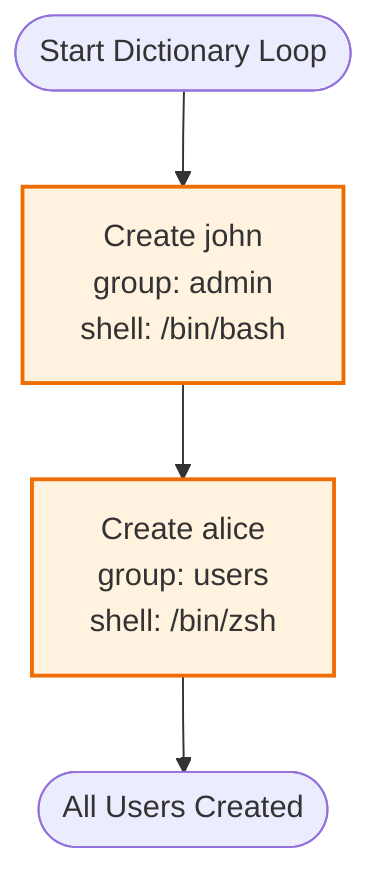
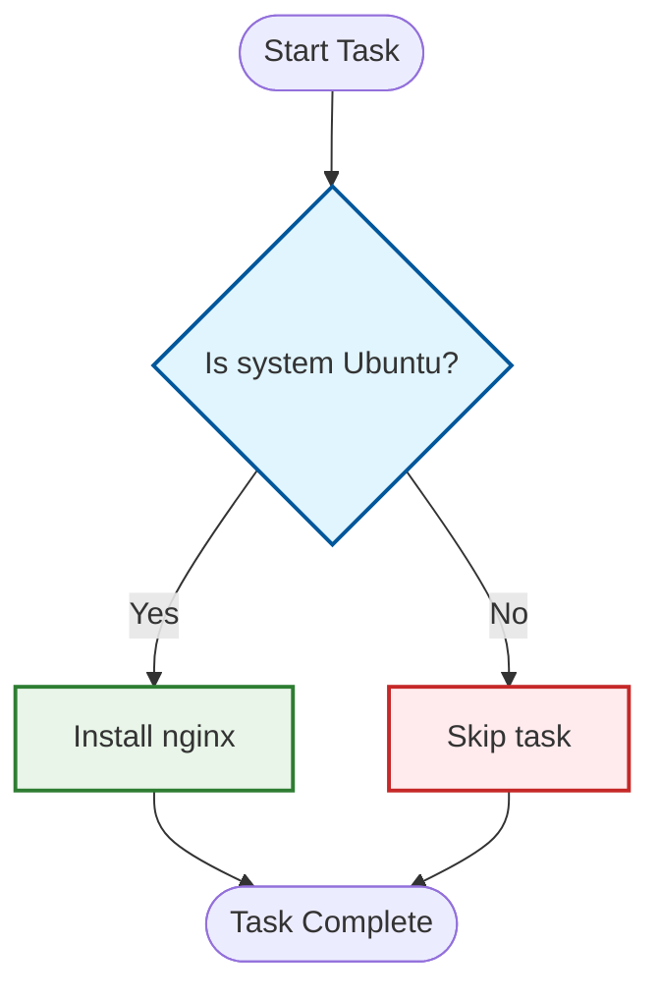
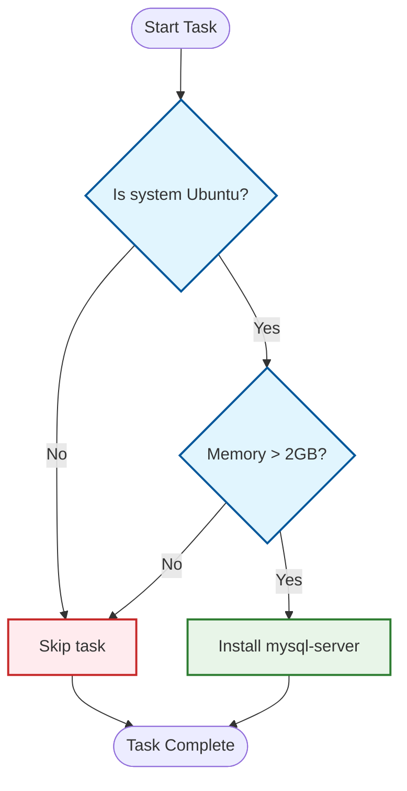
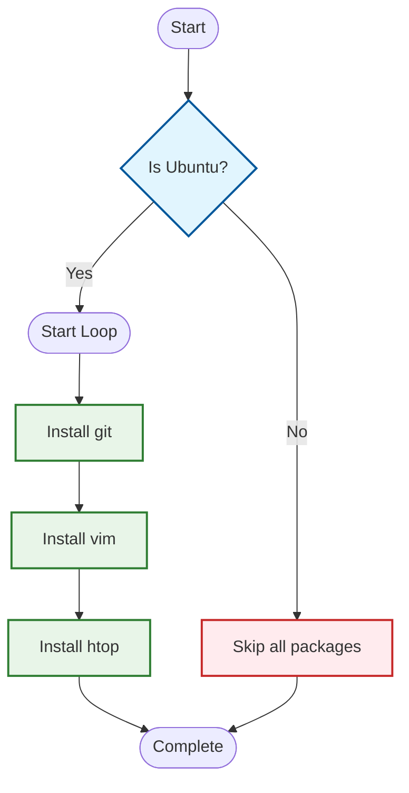
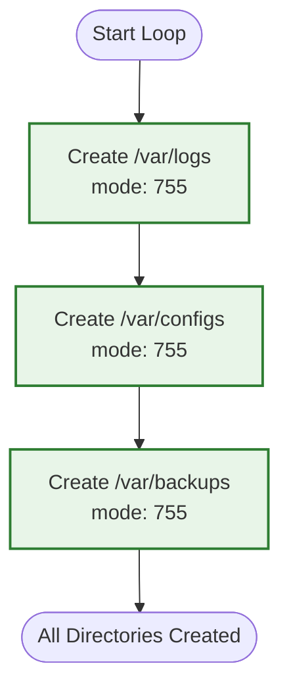
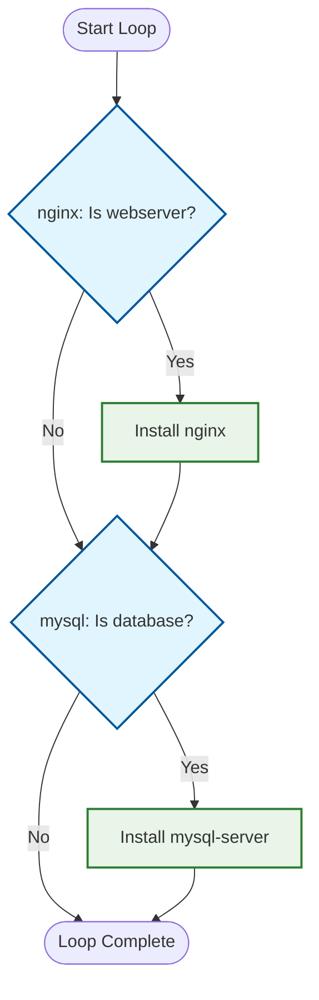
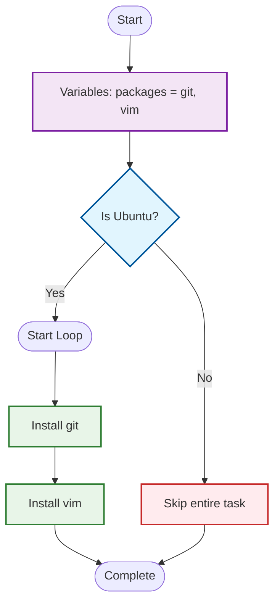

# Module 5: Facts, Variables, Loops and Conditions with NGINX Installation

## Objective
Learn to use Ansible facts, differentiate facts from variables, and implement loops and conditions by installing and configuring NGINX based on host characteristics.

## Prerequisites
- Ansible properly configured
- Access to target hosts with sudo privileges
- Understanding of basic Ansible concepts

## Understanding Core Concepts

### Facts vs Variables

**Facts:**
- Automatically gathered information about remote hosts
- Examples: `ansible_os_family`, `ansible_hostname`, `ansible_distribution`
- Collected during fact gathering phase
- Read-only system information

**Variables:**
- User-defined or manually set values
- Can be defined in playbooks, inventory, or command line
- Examples: `http_port`, `server_name`, `app_version`
- Modifiable and customizable

## Lab Setup

### Create Inventory
Create `hosts.ini`:

```ini
[web_servers]
web1 ansible_host=192.168.1.101 ansible_user=ansibleuser
web2 ansible_host=192.168.1.102 ansible_user=ansibleuser

[db_servers]  
db1 ansible_host=192.168.1.103 ansible_user=ansibleuser

[all:vars]
ansible_ssh_common_args='-o StrictHostKeyChecking=no'
```
## Variables - Storing Information

Variables are like boxes where you store information to use later.

### Why Use Variables?

1. **Avoid repetition** - Write once, use many times
2. **Easy changes** - Change in one place, updates everywhere
3. **Make code flexible** - Same code works in different situations

### Simple Variables

```yaml
vars:
  web_package: nginx
  web_port: 80
  admin_user: webadmin

tasks:
  - name: Install web server
    apt:
      name: "{{ web_package }}"
      state: present
```

### List Variables

When you have multiple items of the same type:

```yaml

vars:
  packages:
    - nginx
    - mysql-server
    - php
  
tasks:
  - name: Install packages
    apt:
      name: "{{ item }}"
      state: present
    loop: "{{ packages }}"
```

### Dictionary Variables

When you have related information grouped together:

```yaml
vars:
  database:
    name: myapp
    user: dbuser
    password: secret123
    
tasks:
  - name: Create database
    mysql_db:
      name: "{{ database.name }}"
      state: present
```

## Loops - Doing Things Multiple Times

Instead of writing the same task many times, use loops.



### Basic Loop

```yaml
- name: Create directories
  file:
    path: "/tmp/{{ item }}"
    state: directory
  loop:
    - folder1
    - folder2
    - folder3
```

### Loop with Dictionary



```yaml
- name: Create users with details
  user:
    name: "{{ item.name }}"
    group: "{{ item.group }}"
    shell: "{{ item.shell }}"
  loop:
    - { name: john, group: admin, shell: /bin/bash }
    - { name: alice, group: users, shell: /bin/zsh }
```

## Conditions - Making Decisions

Run tasks only when certain conditions are true.



### Simple Condition

```yaml
- name: Install nginx (Ubuntu only)
  apt:
    name: nginx
    state: present
  when: ansible_distribution == "Ubuntu"
```

### Multiple Conditions



```yaml
- name: Install heavy software
  apt:
    name: mysql-server
    state: present
  when:
    - ansible_distribution == "Ubuntu"
    - ansible_memtotal_mb > 2048
```

## Practice: Converting Ideas

### Exercise 1
**Idea:** "Install git, vim, and htop on Ubuntu servers only"

**Your pseudocode:**


**Solution pseudocode:**
```bash
IF system is Ubuntu:
INSTALL git
INSTALL vim
INSTALL htop
```

**Ansible solution:**
```yaml
- name: Install development tools
  apt:
    name: "{{ item }}"
    state: present
  loop:
    - git
    - vim
    - htop
  when: ansible_distribution == "Ubuntu"
```

**Flow diagram:**


### Exercise 2
**Idea:** "Create 3 directories: logs, configs, and backups with proper permissions"

**Your pseudocode:**


**Solution pseudocode:**
```bash
LIST directories = [logs, configs, backups]
FOR each directory IN directories:
CREATE directory /var/{{ directory }}
SET permissions to 755
```


**Ansible solution:**
```yaml
vars:
  directories:
    - logs
    - configs
    - backups

tasks:
  - name: Create application directories
    file:
      path: "/var/{{ item }}"
      state: directory
      mode: '0755'
    loop: "{{ directories }}"
```

**Flow diagram:**


## Common Patterns

### Pattern 1: Install and Start Service
```yaml
vars:
  service_name: nginx
  
tasks:
  - name: Install service
    apt:
      name: "{{ service_name }}"
      state: present
      
  - name: Start service
    service:
      name: "{{ service_name }}"
      state: started
      enabled: yes
```

### Pattern 2: Copy Configuration Files
```yaml
vars:
  config_files:
    - nginx.conf
    - php.ini
    - mysql.conf
    
tasks:
  - name: Copy configuration files
    copy:
      src: "{{ item }}"
      dest: "/etc/{{ item }}"
      backup: yes
    loop: "{{ config_files }}"
```

### Pattern 3: Conditional Installation



```yaml
vars:
  packages:
    - name: nginx
      condition: "{{ 'webserver' in group_names }}"
    - name: mysql-server
      condition: "{{ 'database' in group_names }}"
      
tasks:
  - name: Install role-specific packages
    apt:
      name: "{{ item.name }}"
      state: present
    loop: "{{ packages }}"
    when: item.condition
```

## Tips for Beginners

1. **Start simple** - Begin with basic tasks, add complexity gradually
2. **Use descriptive names** - Make variable and task names clear
3. **Test small changes** - Don't write huge playbooks at once
4. **Use pseudocode first** - Plan before coding
5. **Keep variables organized** - Group related variables together

## Quick Reference

### Variable Usage
```yaml
# Define
vars:
  my_variable: value
  
# Use  
"{{ my_variable }}"
```

### Loop Usage
```yaml
loop:
  - item1
  - item2
```

### Condition Usage
```yaml
when: condition_is_true
```

### Combining All Three



```yaml
vars:
  packages: [git, vim]
  
tasks:
  - name: Install packages on Ubuntu
    apt:
      name: "{{ item }}"
      state: present
    loop: "{{ packages }}"
    when: ansible_distribution == "Ubuntu"
```

Remember: Think in pseudocode first, then translate to Ansible. Start simple and build complexity gradually.


## Lab 1: Basic Facts and Variables

### Create Facts Exploration Playbook

Create `facts_and_variables.yml`:

```yaml
---
- name: Explore Ansible Facts and Variables
  hosts: all
  become: yes
  vars:
    # User-defined variables
    app_name: "MyWebApp"
    app_version: "2.1.0"
    environment: "production"
    admin_email: "admin@company.com"
    
  tasks:
    # FACT GATHERING (automatic)
    - name: "Gather facts about the host"
      setup:
      # This task is usually automatic, but we're making it explicit
      
    - name: "Display important system facts"
      debug:
        msg: |
          === SYSTEM FACTS ===
          Hostname: {{ ansible_hostname }}
          FQDN: {{ ansible_fqdn }}
          OS Family: {{ ansible_os_family }}
          Distribution: {{ ansible_distribution }}
          Distribution Version: {{ ansible_distribution_version }}
          Architecture: {{ ansible_architecture }}
          Processor Count: {{ ansible_processor_vcpus }}
          Memory (MB): {{ ansible_memtotal_mb }}
          Default IPv4: {{ ansible_default_ipv4.address }}
          
    - name: "Display user-defined variables"
      debug:
        msg: |
          === USER VARIABLES ===
          Application: {{ app_name }}
          Version: {{ app_version }}
          Environment: {{ environment }}
          Admin Email: {{ admin_email }}
          
    - name: "Show difference between facts and variables"
      debug:
        msg: |
          === FACTS vs VARIABLES ===
          
          FACTS (from system):
          - OS: {{ ansible_distribution }} {{ ansible_distribution_version }}
          - Hostname: {{ ansible_hostname }}
          - IP: {{ ansible_default_ipv4.address }}
          
          VARIABLES (user-defined):
          - App: {{ app_name }} v{{ app_version }}
          - Env: {{ environment }}
          - Contact: {{ admin_email }}
          
    # CUSTOM FACTS
    - name: "Create custom fact directory"
      file:
        path: /etc/ansible/facts.d
        state: directory
        mode: '0755'
        
    - name: "Create custom fact file"
      copy:
        content: |
          [server_info]
          role={{ group_names[0] | default('undefined') }}
          deployment_date={{ ansible_date_time.date }}
          installed_by=ansible
        dest: /etc/ansible/facts.d/server_info.fact
        mode: '0644'
        
    - name: "Re-gather facts to include custom facts"
      setup:
        
    - name: "Display custom facts"
      debug:
        msg: |
          === CUSTOM FACTS ===
          Server Role: {{ ansible_local.server_info.server_info.role }}
          Deployment Date: {{ ansible_local.server_info.server_info.deployment_date }}
          Installed By: {{ ansible_local.server_info.server_info.installed_by }}
```

## Lab 2: NGINX Installation with Conditions

### Create OS-Specific NGINX Installation

Create `install_nginx_conditional.yml`:

```yaml
---
- name: Install NGINX based on OS type using Facts and Conditions
  hosts: web_servers
  become: yes
  vars:
    nginx_port: 80
    nginx_ssl_port: 443
    server_admin: "webmaster@company.com"
    
  tasks:
    - name: "Display target system information"
      debug:
        msg: |
          Installing NGINX on:
          - Host: {{ ansible_hostname }}
          - OS: {{ ansible_distribution }} {{ ansible_distribution_version }}
          - Family: {{ ansible_os_family }}
          - Architecture: {{ ansible_architecture }}
          
    # CONDITIONAL INSTALLATION BASED ON OS FAMILY
    - name: "Install NGINX on RedHat/CentOS systems"
      yum:
        name: nginx
        state: latest
      when: ansible_os_family == "RedHat"
      register: nginx_install_rhel
      
    - name: "Install NGINX on Debian/Ubuntu systems"
      apt:
        name: nginx
        state: latest
        update_cache: yes
      when: ansible_os_family == "Debian"
      register: nginx_install_debian
      
    - name: "Install NGINX on SUSE systems"
      zypper:
        name: nginx
        state: latest
      when: ansible_os_family == "Suse"
      register: nginx_install_suse
      
    # CONDITIONAL FIREWALL CONFIGURATION
    - name: "Configure firewall for NGINX (firewalld - RHEL/CentOS)"
      firewalld:
        service: "{{ item }}"
        permanent: yes
        state: enabled
        immediate: yes
      loop:
        - http
        - https
      when: 
        - ansible_os_family == "RedHat"
        - ansible_distribution_major_version|int >= 7
      ignore_errors: yes
      
    - name: "Configure firewall for NGINX (ufw - Ubuntu/Debian)"
      ufw:
        rule: allow
        port: "{{ item }}"
        proto: tcp
      loop:
        - "{{ nginx_port }}"
        - "{{ nginx_ssl_port }}"
      when: ansible_os_family == "Debian"
      ignore_errors: yes
      
    # START AND ENABLE SERVICE
    - name: "Start and enable NGINX service"
      service:
        name: nginx
        state: started
        enabled: yes
      register: nginx_service
      
    # CONDITIONAL CONFIGURATION BASED ON SYSTEM RESOURCES
    - name: "Configure NGINX worker processes based on CPU count"
      lineinfile:
        path: /etc/nginx/nginx.conf
        regexp: '^worker_processes'
        line: "worker_processes {{ ansible_processor_vcpus }};"
        backup: yes
      notify: restart nginx
      
    - name: "Configure worker connections based on memory"
      lineinfile:
        path: /etc/nginx/nginx.conf
        regexp: '^\s*worker_connections'
        line: "    worker_connections {{ (ansible_memtotal_mb / 4) | int }};"
        insertafter: 'events {'
        backup: yes
      notify: restart nginx
      when: ansible_memtotal_mb > 1024
      
    # DISPLAY RESULTS
    - name: "Display installation results"
      debug:
        msg: |
          === NGINX INSTALLATION RESULTS ===
          
          System: {{ ansible_distribution }} {{ ansible_distribution_version }}
          Installation Method: {{ 
            'YUM (RedHat)' if ansible_os_family == 'RedHat' else
            'APT (Debian)' if ansible_os_family == 'Debian' else
            'Zypper (SUSE)' if ansible_os_family == 'Suse' else
            'Unknown'
          }}
          
          Service Status: {{ 'Started' if nginx_service.changed else 'Already Running' }}
          Worker Processes: {{ ansible_processor_vcpus }}
          Worker Connections: {{ (ansible_memtotal_mb / 4) | int if ansible_memtotal_mb > 1024 else 'Default' }}
          
          Ports Configured:
          - HTTP: {{ nginx_port }}
          - HTTPS: {{ nginx_ssl_port }}
          
  handlers:
    - name: restart nginx
      service:
        name: nginx
        state: restarted
```

## Lab 3: Advanced Loops and Conditions

### Create Advanced Configuration Playbook

Create `nginx_advanced_config.yml`:

```yaml
---
- name: Advanced NGINX Configuration with Loops and Conditions
  hosts: web_servers
  become: yes
  vars:
    # List of virtual hosts to create
    virtual_hosts:
      - name: "www.example.com"
        port: 80
        ssl: false
        document_root: "/var/www/example.com"
      - name: "secure.example.com"
        port: 443
        ssl: true
        document_root: "/var/www/secure.example.com"
      - name: "api.example.com"
        port: 8080
        ssl: false
        document_root: "/var/www/api.example.com"
        
    # List of modules to install
    nginx_modules:
      - name: "nginx-module-geoip"
        condition: "{{ ansible_memtotal_mb > 2048 }}"
      - name: "nginx-module-image-filter"
        condition: "{{ ansible_processor_vcpus >= 2 }}"
      - name: "nginx-module-perl"
        condition: false
        
    # Security headers to add
    security_headers:
      - "X-Frame-Options DENY"
      - "X-Content-Type-Options nosniff"
      - "X-XSS-Protection 1; mode=block"
      - "Strict-Transport-Security max-age=31536000; includeSubDomains"
      
  tasks:
    # LOOP: CREATE DOCUMENT ROOTS
    - name: "Create document root directories"
      file:
        path: "{{ item.document_root }}"
        state: directory
        owner: www-data
        group: www-data
        mode: '0755'
      loop: "{{ virtual_hosts }}"
      when: item.document_root is defined
      
    # LOOP: CREATE INDEX FILES
    - name: "Create index.html for each virtual host"
      copy:
        content: |
          <!DOCTYPE html>
          <html>
          <head>
              <title>{{ item.name }}</title>
              <style>
                  body { font-family: Arial, sans-serif; margin: 40px; }
                  .info { background: #f0f0f0; padding: 20px; border-radius: 5px; }
              </style>
          </head>
          <body>
              <h1>Welcome to {{ item.name }}</h1>
              <div class="info">
                  <h3>Server Information:</h3>
                  <p><strong>Hostname:</strong> {{ ansible_hostname }}</p>
                  <p><strong>OS:</strong> {{ ansible_distribution }} {{ ansible_distribution_version }}</p>
                  <p><strong>IP Address:</strong> {{ ansible_default_ipv4.address }}</p>
                  <p><strong>Port:</strong> {{ item.port }}</p>
                  <p><strong>SSL Enabled:</strong> {{ item.ssl | default(false) }}</p>
                  <p><strong>Generated:</strong> {{ ansible_date_time.iso8601 }}</p>
              </div>
          </body>
          </html>
        dest: "{{ item.document_root }}/index.html"
        owner: www-data
        group: www-data
        mode: '0644'
      loop: "{{ virtual_hosts }}"
      
    # LOOP WITH CONDITIONS: INSTALL OPTIONAL MODULES
    - name: "Install optional NGINX modules based on conditions"
      package:
        name: "{{ item.name }}"
        state: present
      loop: "{{ nginx_modules }}"
      when: 
        - item.condition | default(false)
        - ansible_os_family == "Debian"  # Only on Debian/Ubuntu
      ignore_errors: yes
      
    # NESTED LOOPS: CREATE VIRTUAL HOST CONFIGS
    - name: "Create NGINX virtual host configurations"
      copy:
        content: |
          server {
              listen {{ item.port }} ssl;
              server_name {{ item.name }};
              root {{ item.document_root }};
              index index.html index.htm;
              
              # Security headers
          
              add_header {{ header }};
          
              
              # Logging
              access_log /var/log/nginx/{{ item.name }}_access.log;
              error_log /var/log/nginx/{{ item.name }}_error.log;
              
              location / {
                  try_files $uri $uri/ =404;
              }
              
              # Deny access to hidden files
              location ~ /\. {
                  deny all;
              }
              
          
              # SSL Configuration (placeholder)
              ssl_certificate /etc/ssl/certs/{{ item.name }}.crt;
              ssl_certificate_key /etc/ssl/private/{{ item.name }}.key;
              ssl_protocols TLSv1.2 TLSv1.3;
              ssl_ciphers ECDHE-RSA-AES256-GCM-SHA384:ECDHE-RSA-AES128-GCM-SHA256;
          
          }
        dest: "/etc/nginx/sites-available/{{ item.name }}"
        backup: yes
      loop: "{{ virtual_hosts }}"
      notify: restart nginx
      
    # CONDITIONAL LOOP: ENABLE SITES
    - name: "Enable virtual host sites"
      file:
        src: "/etc/nginx/sites-available/{{ item.name }}"
        dest: "/etc/nginx/sites-enabled/{{ item.name }}"
        state: link
      loop: "{{ virtual_hosts }}"
      when: not item.ssl | default(false)  # Only enable non-SSL sites for now
      notify: restart nginx
      
    # COMPLEX CONDITIONS: CONFIGURE BASED ON SYSTEM SPECS
    - name: "Configure NGINX for high-performance systems"
      blockinfile:
        path: /etc/nginx/nginx.conf
        marker: "# {mark} ANSIBLE MANAGED HIGH PERFORMANCE CONFIG"
        insertbefore: "http {"
        block: |
          # High performance configuration
          worker_processes {{ ansible_processor_vcpus }};
          worker_rlimit_nofile {{ (ansible_memtotal_mb * 1024) | int }};
          
          events {
              worker_connections {{ (ansible_memtotal_mb / 2) | int }};
              use epoll;
              multi_accept on;
          }
      when: 
        - ansible_memtotal_mb > 4096
        - ansible_processor_vcpus >= 4
      notify: restart nginx
      
    - name: "Configure NGINX for low-resource systems"
      blockinfile:
        path: /etc/nginx/nginx.conf
        marker: "# {mark} ANSIBLE MANAGED LOW RESOURCE CONFIG"
        insertbefore: "http {"
        block: |
          # Low resource configuration
          worker_processes 1;
          worker_rlimit_nofile 1024;
          
          events {
              worker_connections 512;
          }
      when: 
        - ansible_memtotal_mb <= 1024
        - ansible_processor_vcpus < 2
      notify: restart nginx
      
    # LOOP WITH MULTIPLE CONDITIONS
    - name: "Create SSL certificates for SSL-enabled sites"
      shell: |
        openssl req -x509 -nodes -days 365 -newkey rsa:2048 \
        -keyout /etc/ssl/private/{{ item.name }}.key \
        -out /etc/ssl/certs/{{ item.name }}.crt \
        -subj "/C=US/ST=State/L=City/O=Organization/CN={{ item.name }}"
      loop: "{{ virtual_hosts }}"
      when: 
        - item.ssl | default(false)
        - ansible_os_family == "Debian"
      args:
        creates: "/etc/ssl/certs/{{ item.name }}.crt"
      notify: restart nginx
      
    # VALIDATION AND RESULTS
    - name: "Test NGINX configuration"
      command: nginx -t
      register: nginx_test
      changed_when: false
      
    - name: "Display configuration summary"
      debug:
        msg: |
          === NGINX CONFIGURATION SUMMARY ===
          
          System Specifications:
          - Memory: {{ ansible_memtotal_mb }} MB
          - CPUs: {{ ansible_processor_vcpus }}
          - Performance Profile: {{ 
            'High Performance' if (ansible_memtotal_mb > 4096 and ansible_processor_vcpus >= 4) else
            'Low Resource' if (ansible_memtotal_mb <= 1024 and ansible_processor_vcpus < 2) else
            'Standard'
          }}
          
          Virtual Hosts Configured:
          
          - {{ host.name }} (Port: {{ host.port }}, SSL: {{ host.ssl | default(false) }})
          
          
          Configuration Test: {{ 'PASSED' if nginx_test.rc == 0 else 'FAILED' }}
          
  handlers:
    - name: restart nginx
      service:
        name: nginx
        state: restarted
```

## Lab 4: Facts Collection and Analysis

### Create Facts Analysis Playbook

Create `facts_analysis.yml`:

```yaml
---
- name: Comprehensive Facts Analysis and Reporting
  hosts: all
  gather_facts: yes
  
  tasks:
    - name: "Analyze system facts and generate report"
      set_fact:
        system_report:
          basic_info:
            hostname: "{{ ansible_hostname }}"
            fqdn: "{{ ansible_fqdn }}"
            os: "{{ ansible_distribution }} {{ ansible_distribution_version }}"
            kernel: "{{ ansible_kernel }}"
            architecture: "{{ ansible_architecture }}"
          
          hardware:
            cpu_count: "{{ ansible_processor_vcpus }}"
            cpu_model: "{{ ansible_processor[2] | default('Unknown') }}"
            memory_mb: "{{ ansible_memtotal_mb }}"
            memory_gb: "{{ (ansible_memtotal_mb / 1024) | round(1) }}"
            
          network:
            primary_ip: "{{ ansible_default_ipv4.address | default('N/A') }}"
            interfaces: "{{ ansible_interfaces | length }}"
            gateway: "{{ ansible_default_ipv4.gateway | default('N/A') }}"
            
          storage:
            mounts: "{{ ansible_mounts | length }}"
            root_size_gb: "{{ (ansible_mounts | selectattr('mount', 'equalto', '/') | map(attribute='size_total') | first / 1024 / 1024 / 1024) | round(1) }}"
            
          services:
            ssh_port: "{{ ansible_ssh_port | default(22) }}"
            python_version: "{{ ansible_python_version }}"
            
    - name: "Display comprehensive system report"
      debug:
        var: system_report
        
    - name: "Create system inventory file"
      copy:
        content: |
          # System Inventory Report
          # Generated: {{ ansible_date_time.iso8601 }}
          
          ## {{ ansible_hostname }} ({{ ansible_default_ipv4.address }})
          
          ### Basic Information
          - **OS**: {{ ansible_distribution }} {{ ansible_distribution_version }}
          - **Kernel**: {{ ansible_kernel }}
          - **Architecture**: {{ ansible_architecture }}
          - **FQDN**: {{ ansible_fqdn }}
          
          ### Hardware
          - **CPU**: {{ ansible_processor_vcpus }} cores ({{ ansible_processor[2] | default('Unknown') }})
          - **Memory**: {{ (ansible_memtotal_mb / 1024) | round(1) }} GB
          - **Storage**: {{ (ansible_mounts | selectattr('mount', 'equalto', '/') | map(attribute='size_total') | first / 1024 / 1024 / 1024) | round(1) }} GB root filesystem
          
          ### Network
          - **Primary IP**: {{ ansible_default_ipv4.address }}
          - **Gateway**: {{ ansible_default_ipv4.gateway | default('N/A') }}
          - **Interfaces**: {{ ansible_interfaces | join(', ') }}
          
          ### Services
          - **SSH Port**: {{ ansible_ssh_port | default(22) }}
          - **Python**: {{ ansible_python_version }}
          
          ### Group Membership
          - **Groups**: {{ group_names | join(', ') }}
        dest: "/tmp/{{ ansible_hostname }}_inventory.md"
        
    - name: "Fetch inventory files to control machine"
      fetch:
        src: "/tmp/{{ ansible_hostname }}_inventory.md"
        dest: "./inventory_reports/"
        flat: yes
```

## Running the Labs

### Execute Facts and Variables Demo

```bash
# Run facts exploration
ansible-playbook -i hosts.ini facts_and_variables.yml

# Gather specific facts only
ansible-playbook -i hosts.ini facts_and_variables.yml --extra-vars "gather_subset=network,hardware"
```

### Execute NGINX Installation

```bash
# Install NGINX with OS detection
ansible-playbook -i hosts.ini install_nginx_conditional.yml

# Run with verbose output to see conditional logic
ansible-playbook -i hosts.ini install_nginx_conditional.yml -v
```

### Execute Advanced Configuration

```bash
# Apply advanced NGINX configuration
ansible-playbook -i hosts.ini nginx_advanced_config.yml

# Test configuration only
ansible-playbook -i hosts.ini nginx_advanced_config.yml --check
```

### Execute Facts Analysis

```bash
# Generate comprehensive system reports
ansible-playbook -i hosts.ini facts_analysis.yml

# Check generated reports
ls -la inventory_reports/
```

## Key Learning Points

### Facts vs Variables
1. **Facts**: System-discovered information (read-only)
2. **Variables**: User-defined values (configurable)
3. **Custom Facts**: User-created system information
4. **Magic Variables**: Ansible-provided variables (group_names, inventory_hostname)

### Conditional Execution
```yaml
# Simple condition
when: ansible_os_family == "Debian"

# Multiple conditions (AND)
when: 
  - ansible_memtotal_mb > 1024
  - ansible_processor_vcpus >= 2

# Multiple conditions (OR)
when: ansible_os_family == "Debian" or ansible_os_family == "RedHat"

# Complex conditions
when: (ansible_distribution == "Ubuntu" and ansible_distribution_major_version|int >= 18) or ansible_distribution == "CentOS"
```

### Loop Patterns
```yaml
# Simple loop
loop: ["item1", "item2", "item3"]

# Loop with conditions
loop: "{{ list_variable }}"
when: item.condition | default(true)

# Loop with complex data
loop: "{{ virtual_hosts }}"
when: item.ssl | default(false)

# Nested loops (using with_nested)
with_nested:
  - "{{ users }}"
  - "{{ groups }}"
```

### Best Practices
1. **Use facts for system-specific decisions**
2. **Define variables for configurable values**
3. **Combine conditions logically**
4. **Use loops for repetitive tasks**
5. **Register results for complex logic**
6. **Create custom facts for application-specific data**

This comprehensive lab demonstrates the power of combining facts, variables, loops, and conditions to create intelligent, adaptive automation!
