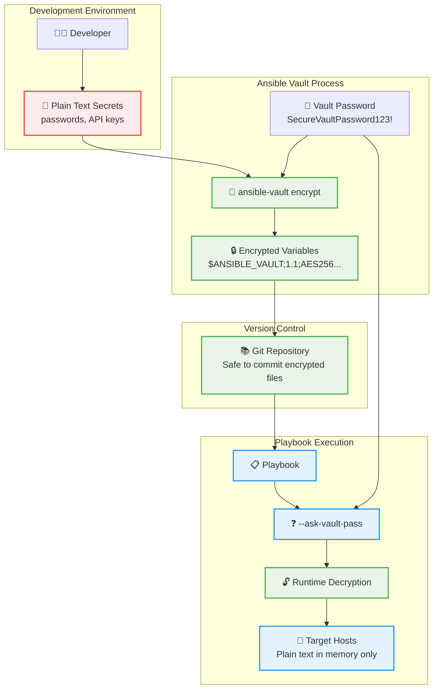

# Module 8: Ansible Vault, Roles, and Building Reusable Playbooks

## Objective
Master Ansible Vault for secure data management, understand and create Ansible roles for code organization, and build reusable automation components for scalable infrastructure management.

## Prerequisites
- Solid understanding of Ansible playbooks and templates
- Experience with variables and inventory management
- Access to target hosts with appropriate privileges

## Understanding Core Concepts

### Ansible Vault
- **Purpose**: Encrypt sensitive data (passwords, keys, API tokens)
- **Security**: AES256 encryption with password-based access
- **Integration**: Seamless use within playbooks and variables
- **Management**: Create, edit, view, and decrypt encrypted files

### Ansible Roles
- **Organization**: Structured way to organize playbooks, variables, templates, and files
- **Reusability**: Share and reuse automation code across projects
- **Modularity**: Break complex playbooks into manageable components
- **Standards**: Follow Ansible Galaxy directory structure

## Lab Setup

### Create Project Structure
```bash
mkdir -p ansible-vault-roles-lab
cd ansible-vault-roles-lab
mkdir -p {roles,playbooks,inventory}
mkdir -p inventory/group_vars/all
mkdir -p playbooks/templates
```

### Complete Setup Commands
```bash
# Create all necessary directories with correct structure
mkdir -p ansible-vault-roles-lab/{roles,playbooks,inventory}
mkdir -p ansible-vault-roles-lab/inventory/group_vars/all
mkdir -p ansible-vault-roles-lab/playbooks/templates
cd ansible-vault-roles-lab
```

### Create Inventory
Create `inventory/hosts.yml`:

```yaml
all:
  hosts:
    localhost:
      ansible_connection: local
  children:
    aws:
      hosts:
        16.171.52.223:
          ansible_user: ubuntu
        51.20.81.242:
          ansible_user: ubuntu
        51.20.83.179:
          ansible_user: ubuntu
      vars:
        ansible_user: ubuntu
        ansible_ssh_private_key_file: ~/.ssh/ansible_key
        ansible_python_interpreter: /usr/bin/python3
        ansible_ssh_common_args: "-o StrictHostKeyChecking=no -o UserKnownHostsFile=/dev/null"
    
    webservers:
      hosts:
        51.20.81.242:
          ansible_user: ubuntu
      vars:
        server_role: "web"
    
    databases:
      hosts:
        51.20.83.179:
          ansible_user: ubuntu
      vars:
        server_role: "database"
    
    loadbalancers:
      hosts:
        51.20.83.179:
          ansible_user: ubuntu
      vars:
        server_role: "loadbalancer"
```

## Lab 1: Ansible Vault Fundamentals



### Create Encrypted Variables

```bash
# Create encrypted file for sensitive data
cd inventory
ansible-vault create group_vars/all/vault.yml
```

When prompted for password, use: `SecureVaultPassword123!`

Add this content to `vault.yml` similar with vi editor:

```yaml
---
# Encrypted sensitive variables
vault_database_password: "SuperSecretDBPassword123!"
vault_api_key: "abc123def456ghi789jkl012"
vault_admin_password: "AdminPassword789!"
vault_backup_encryption_key: "BackupKey321xyz"

# Database credentials
vault_db_users:
  - name: "webapp_user"
    password: "WebAppDBPass123!"
    privileges: "SELECT,INSERT,UPDATE,DELETE"
  - name: "readonly_user"  
    password: "ReadOnlyPass456!"
    privileges: "SELECT"

# API credentials
vault_external_apis:
  payment_gateway:
    api_key: "pg_live_abc123def456"
    secret_key: "pg_secret_xyz789"
  monitoring_service:
    token: "monitor_token_123456"
    webhook_secret: "webhook_secret_abc123"
```

### Create Public Variables

**IMPORTANT**: Create the directory structure and file:

```bash
mkdir -p inventory/group_vars/all
```

Create `inventory/group_vars/all/main.yml`:

```yaml
---
# Public variables that reference vault variables
database_password: "{{ vault_database_password }}"
api_key: "{{ vault_api_key }}"
admin_password: "{{ vault_admin_password }}"

# Application configuration
app_name: "secure-webapp"
app_version: "2.1.0"
environment: "production"

# Database configuration
database_host: "{{ groups['databases'][0] }}"
database_name: "{{ app_name }}_{{ environment }}"
database_users: "{{ vault_db_users }}"

# External service configuration
external_apis: "{{ vault_external_apis }}"

# Backup configuration
backup_enabled: true
backup_encryption_key: "{{ vault_backup_encryption_key }}"
backup_schedule: "0 2 * * *"  # Daily at 2 AM
```

### Create Vault Management Playbook

Create `playbooks/vault_demo.yml`:

```yaml
---
- name: Ansible Vault Demonstration
  hosts: webservers
  become: yes
  vars:
    temp_password_file: "/tmp/secure_passwords.txt"
    
  tasks:
    - name: "Display non-sensitive configuration"
      debug:
        msg: |
          === PUBLIC CONFIGURATION ===
          App Name: {{ app_name }}
          Version: {{ app_version }}
          Environment: {{ environment }}
          Database Host: {{ database_host }}
          Database Name: {{ database_name }}
          Backup Enabled: {{ backup_enabled }}
          
    - name: "Verify vault variables are accessible"
      debug:
        msg: |
          === VAULT VARIABLE ACCESS TEST ===
          Database password length: {{ database_password | length }} characters
          API key prefix: {{ api_key[:10] }}...
          Admin password complexity: {{ 'Strong' if admin_password | length > 10 else 'Weak' }}
          External APIs configured: {{ external_apis | length }}
          
    - name: "Create application configuration directory"
      file:
        path: "/etc/{{ app_name }}"
        state: directory
        owner: root
        group: root
        mode: '0755'
        
    - name: "Create secure configuration file"
      template:
        src: secure_config.j2
        dest: /etc/{{ app_name }}/secure.conf
        owner: root
        group: root
        mode: '0600'  # Restrictive permissions
        backup: yes
      register: secure_config
      
    - name: "Create database users configuration"
      copy:
        content: |
          # Database Users Configuration
          # Generated: {{ ansible_date_time.iso8601 }}
          
          
          [user_{{ user.name }}]
          username={{ user.name }}
          password_hash={{ user.password | password_hash('sha512') }}
          privileges={{ user.privileges }}
          
          
        dest: /etc/{{ app_name }}/db_users.conf
        owner: root
        group: root
        mode: '0600'
      register: db_users_config
      
    - name: "Test external API connectivity"
      uri:
        url: "https://httpbin.org/headers"
        method: GET
        headers:
          Authorization: "Bearer {{ external_apis.monitoring_service.token }}"
        return_content: yes
      register: api_test
      ignore_errors: yes
      
    - name: "Display vault usage results"
      debug:
        msg: |
          === VAULT USAGE RESULTS ===
          
          Secure Config: {{ 'Created' if secure_config.changed else 'Already exists' }}
          DB Users Config: {{ 'Created' if db_users_config.changed else 'Already exists' }}
          Config Directory: {{ 'Created' if db_users_config.changed else 'Already exists' }}
          
          API Test: {{ 'Success' if api_test.status == 200 else 'Failed' }}
          
          Files created with restricted permissions:
          - /etc/{{ app_name }}/secure.conf (600)
          - /etc/{{ app_name }}/db_users.conf (600)
```

### Create Secure Configuration Template

**IMPORTANT**: Create the templates directory:

```bash
mkdir -p playbooks/templates
```

Create `playbooks/templates/secure_config.j2`:

```ini
# Secure Configuration for {{ app_name | title }}
# Generated: {{ ansible_date_time.iso8601 }}
# WARNING: This file contains sensitive information

[database]
host={{ database_host }}
name={{ database_name }}
password={{ database_password }}

[api_keys]
main_api_key={{ api_key }}
payment_gateway_key={{ external_apis.payment_gateway.api_key }}
payment_gateway_secret={{ external_apis.payment_gateway.secret_key }}
monitoring_token={{ external_apis.monitoring_service.token }}

[backup]
enabled={{ backup_enabled | lower }}
encryption_key={{ backup_encryption_key }}
schedule={{ backup_schedule }}

[security]
admin_password_hash={{ admin_password | password_hash('sha512') }}
session_secret={{ api_key | hash('md5') }}
```

## Lab 2: Creating Simple Ansible Roles

### Create Simple NGINX Role

```bash
# Create role directory structure
cd ansible-vault-roles-lab/roles/
ansible-galaxy init roles/nginx_website
```

This creates:
```
roles/nginx_website/
├── defaults/main.yml
├── files/
├── handlers/main.yml
├── meta/main.yml
├── tasks/main.yml
├── templates/
├── tests/
└── vars/main.yml
```

### Configure Simple NGINX Role

Edit `roles/nginx_website/defaults/main.yml`:

```yaml
---
# Simple default variables for nginx_website role
website_title: "Ansible Course Website"
website_content: "Welcome to our Ansible training!"
web_directory: "/var/www/html"
```

Edit `roles/nginx_website/tasks/main.yml`:

```yaml
---
# Simple tasks for nginx_website role
- name: "Update apt cache"
  apt:
    update_cache: yes
  when: ansible_os_family == "Debian"

- name: "Install nginx"
  package:
    name: nginx
    state: present

- name: "Create web directory"
  file:
    path: "{{ web_directory }}"
    state: directory
    owner: www-data
    group: www-data
    mode: '0755'

- name: "Deploy website content"
  copy:
    content: |
      <!DOCTYPE html>
      <html>
      <head>
          <title>{{ website_title }}</title>
          <style>
              body { 
                  font-family: Arial, sans-serif; 
                  margin: 40px; 
                  background: linear-gradient(135deg, #667eea 0%, #764ba2 100%);
                  color: white;
              }
              .container { 
                  background: rgba(255,255,255,0.1); 
                  padding: 30px; 
                  border-radius: 15px; 
                  backdrop-filter: blur(10px);
              }
              .highlight { color: #ffd700; font-weight: bold; }
          </style>
      </head>
      <body>
          <div class="container">
              <h1>{{ website_title }}</h1>
              <p>{{ website_content }}</p>
              <h3>Server Information:</h3>
              <p><strong>Hostname:</strong> {{ ansible_hostname }}</p>
              <p><strong>IP:</strong> {{ ansible_default_ipv4.address }}</p>
              <p><strong>OS:</strong> {{ ansible_distribution }} {{ ansible_distribution_version }}</p>
              <p class="highlight">Deployed with Ansible!</p>
          </div>
      </body>
      </html>
    dest: "{{ web_directory }}/index.html"
    owner: www-data
    group: www-data
    mode: '0644'

- name: "Start and enable nginx"
  service:
    name: nginx
    state: started
    enabled: yes

- name: "Allow HTTP through firewall"
  ufw:
    rule: allow
    port: '80'
    proto: tcp
  when: ansible_os_family == "Debian"

- name: "Display website deployment results"
  debug:
    msg: |
      === WEBSITE DEPLOYMENT COMPLETE ===
      
      Website: {{ website_title }}
      URL: http://{{ ansible_default_ipv4.address }}/
      Web Directory: {{ web_directory }}
      Nginx Status: Running
```

Edit `roles/nginx_website/handlers/main.yml`:

```yaml
---
# Simple handlers for nginx_website role
- name: restart nginx
  service:
    name: nginx
    state: restarted
```

### Create Simple Role-Based Playbook

Create `playbooks/deploy_website.yml`:

```yaml
---
- name: Deploy Website using Role
  hosts: webservers
  become: yes
  vars:
    # Customize the website
    website_title: "My Ansible Website"
    website_content: "This website was deployed using Ansible roles!"
    
  roles:
    - role: nginx_website
      
  post_tasks:
    - name: "Test website deployment"
      uri:
        url: "http://{{ ansible_default_ipv4.address }}/"
        method: GET
      register: website_test
      ignore_errors: yes
      
    - name: "Display deployment results"
      debug:
        msg: |
          === WEBSITE DEPLOYMENT RESULTS ===
          
          Host: {{ ansible_hostname }}
          Website: {{ website_title }}
          URL: http://{{ ansible_default_ipv4.address }}/
          Test Result: {{ 'SUCCESS' if website_test.status == 200 else 'FAILED' }}
          
          You can now visit: http://{{ ansible_default_ipv4.address }}/
```

### Create Multiple Website Playbook

Create `playbooks/deploy_multiple_websites.yml`:

```yaml
---
- name: Deploy Multiple Websites with Different Content
  hosts: webservers
  become: yes
  
  tasks:
    - name: "Deploy Company Website"
      include_role:
        name: nginx_website
      vars:
        website_title: "Company Website"
        website_content: "Welcome to our company!"
        web_directory: "/var/www/company"
        
    - name: "Deploy Blog Website"
      include_role:
        name: nginx_website
      vars:
        website_title: "Company Blog"
        website_content: "Read our latest blog posts!"
        web_directory: "/var/www/blog"
        
    - name: "Display all websites"
      debug:
        msg: |
          === MULTIPLE WEBSITES DEPLOYED ===
          
          Company Site: http://{{ ansible_default_ipv4.address }}/company/
          Blog Site: http://{{ ansible_default_ipv4.address }}/blog/
```

## Running the Labs

### Execute Vault Operations

```bash
# Create encrypted file
ansible-vault create inventory/group_vars/all/vault.yml

# Edit encrypted file
ansible-vault edit inventory/group_vars/all/vault.yml

# Run playbook with vault
ansible-playbook -i inventory/hosts.yml playbooks/vault_demo.yml --ask-vault-pass

# Alternative: if you're in the project directory, you can use:
ansible-playbook -i inventory/ playbooks/vault_demo.yml --ask-vault-pass
```

### Execute Role-Based Deployment

```bash
# Deploy website using role
ansible-playbook -i inventory/hosts.yml playbooks/deploy_website.yml

# Deploy multiple websites
ansible-playbook -i inventory/hosts.yml playbooks/deploy_multiple_websites.yml

# Test role reusability with different variables
ansible-playbook -i inventory/hosts.yml playbooks/deploy_website.yml -e "website_title='Custom Title'"
```

## Key Learning Points

### Ansible Vault Best Practices
1. **Separate Vault Files**: Keep encrypted data in separate files
2. **Reference Variables**: Use vault variables in public files
3. **Descriptive Names**: Prefix vault variables with `vault_`
4. **Password Management**: Use password files or environment variables
5. **File Permissions**: Protect vault password files (600)

### Role Design Principles
1. **Single Responsibility**: Each role should have one clear purpose
2. **Parameterization**: Use variables for customization
3. **Idempotency**: All tasks should be idempotent
4. **Documentation**: Include README and meta information
5. **Testing**: Include test scenarios and validation

### Role Structure Best Practices
- **defaults/**: Default variable values (lowest precedence)
- **vars/**: Role-specific variables (high precedence)
- **tasks/**: Main automation logic
- **handlers/**: Event-driven tasks
- **templates/**: Dynamic configuration files
- **files/**: Static files to be copied
- **meta/**: Role metadata and dependencies

### Security Considerations
1. **Vault Encryption**: Always encrypt sensitive data
2. **File Permissions**: Set appropriate permissions on sensitive files
3. **Access Control**: Limit vault password access
4. **Audit Trail**: Track vault file changes
5. **Key Rotation**: Regularly update encrypted passwords

This comprehensive lab demonstrates how to build secure, reusable automation components using Ansible Vault and Roles for enterprise-grade infrastructure management!
