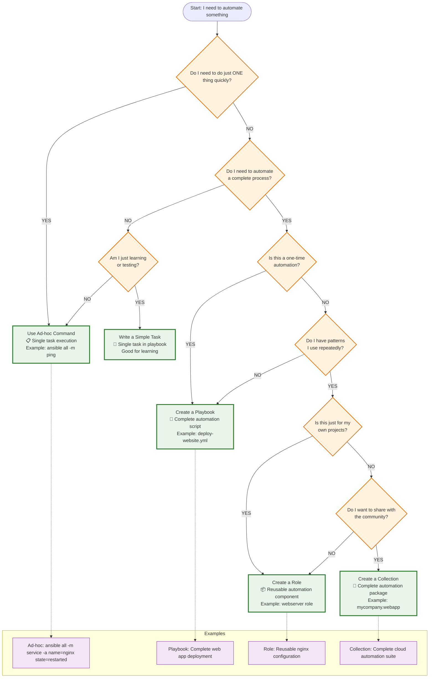

# Ansible Language Elements - Beginner's Guide

## What is Ansible?
Ansible is an automation tool that helps you manage computers remotely. Think of it as a way to give instructions to many computers at once, instead of logging into each one individually.

## Basic Building Blocks

### 1. Task - The Smallest Unit
A **task** is a single action you want to perform on a computer.

**When to use a task:**
- When you want to do just ONE thing
- For quick, simple operations
- For testing or learning

**Example:**
```yaml
- name: Install nginx web server
  ansible.builtin.apt:
    name: nginx
    state: present
```

**Real-world analogy:** A task is like telling someone "Please turn on the lights" - it's one specific instruction.

### 2. Module - The Action Performer
A **module** is the tool that actually does the work in a task.

**Common modules:**
- `apt` - Install/remove software on Ubuntu/Debian
- `service` - Start/stop/restart services
- `copy` - Copy files from control machine to targets
- `user` - Create/modify users
- `file` - Create directories, set permissions

**Example:**
```yaml
- name: Create a user named john
  ansible.builtin.user:    # <- This is the module
    name: john             # <- These are module parameters
    state: present
    create_home: yes
```

**Real-world analogy:** A module is like a specific tool - a hammer, screwdriver, or paintbrush. Each tool does a specific job.

### 3. Play - A Group of Related Tasks
A **play** is a collection of tasks that work together toward a common goal.

**When to use a play:**
- When you have several related tasks
- When targeting a specific group of servers
- When tasks need to run in a specific order

**Example:**
```yaml
- name: Setup web server          # <- This is a play
  hosts: webservers              # <- Target hosts
  become: yes                    # <- Run with sudo
  tasks:                         # <- List of tasks
    - name: Install nginx
      ansible.builtin.apt:
        name: nginx
        state: present
        
    - name: Start nginx
      ansible.builtin.service:
        name: nginx
        state: started
```

**Real-world analogy:** A play is like a recipe - it's a series of steps to achieve one goal (like "make a cake").

### 4. Playbook - The Complete Instructions
A **playbook** is a file containing one or more plays.

**When to use a playbook:**
- When you have multiple related goals
- When you want to automate a complete process
- When you need to target different types of servers

**Example:**
```yaml
---
# This playbook sets up a complete web application
- name: Setup web servers        # <- Play 1
  hosts: webservers
  tasks:
    - name: Install nginx
      ansible.builtin.apt:
        name: nginx
        state: present

- name: Setup database servers   # <- Play 2
  hosts: databases
  tasks:
    - name: Install mysql
      ansible.builtin.apt:
        name: mysql-server
        state: present
```

**Real-world analogy:** A playbook is like a complete instruction manual - it contains multiple recipes (plays) to build something complex.

## Advanced Concepts

### 5. Variables - Storing Information
**Variables** store information that can be reused throughout your playbook.

**When to use variables:**
- When you have values that might change
- When you want to avoid repeating the same information
- When you want to make your playbook flexible

**Example:**
```yaml
---
- name: Install web server
  hosts: webservers
  vars:                          # <- Variables section
    web_package: nginx
    web_port: 80
    admin_user: webadmin
    
  tasks:
    - name: Install {{ web_package }}
      ansible.builtin.apt:
        name: "{{ web_package }}"  # <- Using variable
        state: present
        
    - name: Create admin user
      ansible.builtin.user:
        name: "{{ admin_user }}"   # <- Using variable
        state: present
```

**Real-world analogy:** Variables are like labeled containers - you put information in them and use it whenever needed.

### 6. Loops - Repeating Actions
**Loops** let you repeat the same task multiple times with different values.

**When to use loops:**
- When you need to do the same thing multiple times
- When you have a list of items to process
- To avoid writing the same task repeatedly

**Example:**
```yaml
- name: Install multiple packages
  ansible.builtin.apt:
    name: "{{ item }}"
    state: present
  loop:                          # <- This creates a loop
    - nginx
    - mysql-server
    - php
    - git
```

**Real-world analogy:** A loop is like telling someone "Do this for each item in this list" instead of repeating the instruction for each item.

### 7. Conditions - Making Decisions
**Conditions** let you run tasks only when certain criteria are met.

**When to use conditions:**
- When tasks should only run on certain types of servers
- When you need different behavior based on circumstances
- When you want to skip tasks in certain situations

**Example:**
```yaml
- name: Install nginx (only on web servers)
  ansible.builtin.apt:
    name: nginx
    state: present
  when: inventory_hostname in groups['webservers']  # <- Condition

- name: Install mysql (only on Ubuntu)
  ansible.builtin.apt:
    name: mysql-server
    state: present
  when: ansible_distribution == "Ubuntu"            # <- Condition
```

**Real-world analogy:** Conditions are like "if-then" statements - "If it's raining, then take an umbrella."

## When to Use What?

### Use a Single Task When:
- Learning Ansible basics
- Testing a specific module
- Making quick changes
- Troubleshooting

**Example command:**
```bash
ansible webservers -m service -a "name=nginx state=restarted"
```

### Use a Playbook When:
- Automating a complete process
- Managing infrastructure
- Deploying applications
- Regular maintenance tasks

**Example:** Setting up a complete web application with database, web server, and load balancer.

### Use a Role When:
- You have a reusable set of tasks
- You want to organize complex playbooks
- You need to share automation with others
- You have common patterns across projects

**What is a Role?**
A role is a pre-organized collection of tasks, variables, and files that can be reused.

**Role structure:**
```bash
webserver-role/
├── tasks/main.yml # <- Main tasks
├── vars/main.yml # <- Variables
├── files/ # <- Files to copy
├── templates/ # <- Template files
└── handlers/main.yml # <- Event handlers
```

**When to create a role:**
- When you find yourself copying the same tasks between playbooks
- When you want to share your automation with others
- When your playbook becomes too complex

**Example of using a role:**
```yaml
---
- name: Setup web servers using role
  hosts: webservers
  roles:
    - webserver-role      # <- Using a role instead of writing tasks
```

### Use a Collection When:
- You're creating multiple related roles and modules
- You want to distribute a complete automation solution
- You're building automation for a specific technology (like AWS, VMware, etc.)

**What is a Collection?**
A collection is a package that contains multiple roles, modules, and plugins related to a specific technology or use case.

**When to create a collection:**
- When you have many roles that work together
- When you're building automation for a specific platform
- When you want to distribute your automation through Ansible Galaxy

**Example collections:**
- `amazon.aws` - For AWS automation
- `community.mysql` - For MySQL database automation
- `kubernetes.core` - For Kubernetes automation

## Practical Examples

### Simple Task (Ad-hoc command):
```bash
# Restart nginx on all web servers
ansible webservers -m service -a "name=nginx state=restarted"
```

### Simple Playbook:
```yaml
---
- name: Basic web server setup
  hosts: webservers
  become: yes
  
  tasks:
    - name: Install nginx
      ansible.builtin.apt:
        name: nginx
        state: present
        
    - name: Start nginx
      ansible.builtin.service:
        name: nginx
        state: started
```

### Playbook with Variables and Loops:
```yaml
---
- name: Advanced web server setup
  hosts: webservers
  become: yes
  vars:
    packages:
      - nginx
      - php
      - mysql-client
    web_user: www-data
    
  tasks:
    - name: Install packages
      ansible.builtin.apt:
        name: "{{ item }}"
        state: present
      loop: "{{ packages }}"
      
    - name: Create web user
      ansible.builtin.user:
        name: "{{ web_user }}"
        system: yes
      when: ansible_distribution == "Ubuntu"
```

## Best Practices for Beginners

### 1. Start Simple
- Begin with single tasks
- Move to simple playbooks
- Add complexity gradually

### 2. Use Descriptive Names
```yaml
# Good
- name: Install nginx web server
  
# Bad  
- name: Install stuff
```

### 3. Organize Your Code
- Use variables for values that might change
- Group related tasks into plays
- Consider roles when you have reusable patterns

### 4. Test Your Work
- Use `--check` mode to see what would change
- Start with a small number of hosts
- Verify results after running playbooks

## Decision Tree: What Should I Use?
```bash
Do I need to do just ONE thing quickly?
├── YES → Use an ad-hoc command (single task)
└── NO → Continue
Do I need to automate a complete process?
├── YES → Use a playbook
└── NO → Continue
Do I have reusable patterns I use often?
├── YES → Create a role
└── NO → Continue
Do I want to distribute a complete automation solution?
├── YES → Create a collection
└── NO → Stick with playbooks
````

Decision tree:


Simplified Decision tree:

```mermaid
flowchart TD
    START([What do I want to do?]) --> SIMPLE{Something simple<br/>and quick?}
    
    SIMPLE -->|YES| QUICK{Just one command?}
    QUICK -->|YES| ADHOC[🔧 Ad-hoc Command<br/>ansible all -m ping]
    QUICK -->|NO| TASK[📋 Simple Task<br/>One task in playbook]
    
    SIMPLE -->|NO| COMPLEX{Complex automation<br/>with multiple steps?}
    
    COMPLEX -->|YES| REUSE{Will I use this<br/>again and again?}
    
    REUSE -->|NO| PLAYBOOK[📄 Playbook<br/>Complete automation script]
    REUSE -->|YES| SHARE{Do I want to<br/>share with others?}
    
    SHARE -->|NO| ROLE[📦 Role<br/>Reusable component]
    SHARE -->|YES| COLLECTION[🎁 Collection<br/>Shareable package]
    
    classDef start fill:#e1f5fe,stroke:#01579b,stroke-width:3px
    classDef question fill:#fff3e0,stroke:#ef6c00,stroke-width:2px
    classDef answer fill:#e8f5e8,stroke:#2e7d32,stroke-width:3px
    
    class START start
    class SIMPLE,QUICK,COMPLEX,REUSE,SHARE question
    class ADHOC,TASK,PLAYBOOK,ROLE,COLLECTION answer
````

What we do:
```mermaid
flowchart TD
    START([I need to...]) --> EX1{Restart a service<br/>on all servers?}
    EX1 -->|YES| A1[Ad-hoc Command<br/>ansible all -m service<br/>-a 'name=nginx state=restarted']
    
    START --> EX2{Deploy a complete<br/>web application?}
    EX2 -->|YES| P1[Playbook<br/>install nginx + mysql + app<br/>configure everything]
    
    START --> EX3{Set up web servers<br/>the same way repeatedly?}
    EX3 -->|YES| R1[Role<br/>webserver role with<br/>nginx + php + configs]
    
    START --> EX4{Create automation<br/>for AWS + Docker + K8s?}
    EX4 -->|YES| C1[Collection<br/>mycompany.cloudstack<br/>with multiple roles & modules]
    
    subgraph "Complexity Level"
        LEVEL1[Level 1: Single Action]
        LEVEL2[Level 2: Multiple Actions]
        LEVEL3[Level 3: Reusable Pattern]
        LEVEL4[Level 4: Complete Solution]
    end
    
    A1 -.-> LEVEL1
    P1 -.-> LEVEL2
    R1 -.-> LEVEL3
    C1 -.-> LEVEL4
    
    classDef simple fill:#c8e6c9,stroke:#388e3c,stroke-width:2px
    classDef medium fill:#bbdefb,stroke:#1976d2,stroke-width:2px
    classDef complex fill:#ffcdd2,stroke:#d32f2f,stroke-width:2px
    classDef advanced fill:#f3e5f5,stroke:#7b1fa2,stroke-width:2px
    
    class A1,LEVEL1 simple
    class P1,LEVEL2 medium
    class R1,LEVEL3 complex
    class C1,LEVEL4 advanced
````

Learning path:
```mermaid
flowchart LR
    subgraph "Learning Journey"
        WEEK1[Week 1<br/>Learn Tasks & Ad-hoc]
        WEEK2[Week 2-3<br/>Master Playbooks]
        MONTH2[Month 2<br/>Create Roles]
        MONTH6[Month 6+<br/>Build Collections]
    end
    
    WEEK1 --> DECISION1{Can I solve my<br/>problem with this?}
    DECISION1 -->|YES| USE1[Use Ad-hoc Commands<br/>& Simple Playbooks]
    DECISION1 -->|NO| WEEK2
    
    WEEK2 --> DECISION2{Can I solve my<br/>problem with this?}
    DECISION2 -->|YES| USE2[Use Complex Playbooks<br/>with Variables & Loops]
    DECISION2 -->|NO| MONTH2
    
    MONTH2 --> DECISION3{Can I solve my<br/>problem with this?}
    DECISION3 -->|YES| USE3[Use Roles for<br/>Reusable Automation]
    DECISION3 -->|NO| MONTH6
    
    MONTH6 --> USE4[Create Collections for<br/>Complete Solutions]
    
    classDef learning fill:#e8f5e8,stroke:#2e7d32,stroke-width:2px
    classDef decision fill:#fff3e0,stroke:#ef6c00,stroke-width:2px
    classDef action fill:#e1f5fe,stroke:#01579b,stroke-width:2px
    
    class WEEK1,WEEK2,MONTH2,MONTH6 learning
    class DECISION1,DECISION2,DECISION3 decision
    class USE1,USE2,USE3,USE4 action
```

## Summary

- **Task**: One action (like "install nginx")
- **Module**: The tool that does the action (like `apt`, `service`, `copy`)
- **Play**: A group of related tasks for specific hosts
- **Playbook**: Complete automation instructions (contains plays)
- **Variables**: Store reusable information
- **Loops**: Repeat actions for multiple items
- **Conditions**: Run tasks only when criteria are met
- **Role**: Reusable collection of tasks and files
- **Collection**: Package of multiple roles and modules

**Remember**: Start simple with tasks and playbooks, then move to roles and collections as you become more experienced!